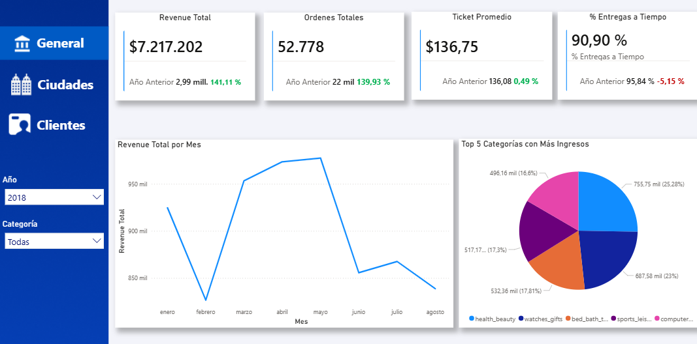
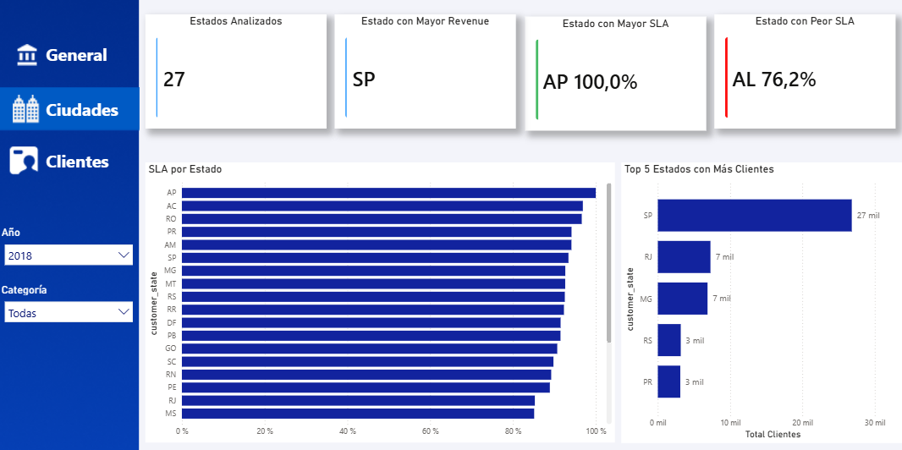
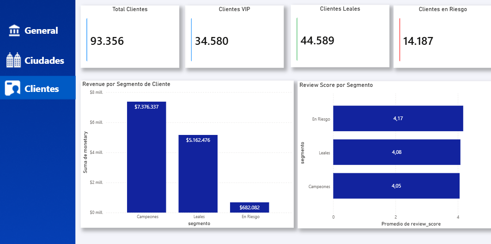

# E-commerce Analysis Pipeline 🛒

Proyecto de análisis de datos end-to-end usando el dataset público de Olist (marketplace brasileño) con Python y Power BI.

## 📊 Dashboard
### General


### Ciudades


### Clientes


## 🏢 Sobre Olist
Olist es un marketplace SaaS brasileño que conecta pequeños vendedores con los principales canales de venta de Brasil. No gestiona logística directamente — los vendedores coordinan sus propios envíos con transportistas externos.

## 📁 Sobre el Dataset
- **Fuente:** [Kaggle — Brazilian E-Commerce Public Dataset by Olist](https://www.kaggle.com/datasets/olistbr/brazilian-ecommerce)
- **Período:** 2016 — 2018
- **Volumen:** +100,000 órdenes reales
- **Tablas utilizadas:**

| Tabla | Uso |
|---|---|
| `olist_orders_dataset` | Órdenes y fechas de entrega |
| `olist_customers_dataset` | Ubicación del cliente por estado |
| `olist_order_items_dataset` | Precio y productos por orden |
| `olist_order_reviews_dataset` | Puntaje de satisfacción del cliente |
| `olist_products_dataset` | Categoría del producto |
| `product_category_name_translation` | Traducción de categorías al inglés |

## 🎯 Preguntas de negocio
- ¿Cómo evoluciona el GMV mensualmente?
- ¿Cuáles son las categorías con mayor revenue?
- ¿En qué estados Brasil tiene peor SLA de entrega?
- ¿Quiénes son los clientes VIP y cuánto representan del GMV total?

## ⚙️ Pipeline automatizado
El pipeline corre automáticamente cada día a las 8:00 AM y ejecuta 3 pasos:
1. **Descarga** del dataset via Kaggle API
2. **ETL** limpieza y transformación de datos
3. **Métricas** cálculo de RFM y SLA


## 🛠️ Stack tecnológico
- **Python** — ETL, limpieza y métricas (pandas, schedule, kaggle)
- **Power BI** — Dashboard ejecutivo interactivo

## 📦 Instalación
```bash
git clone https://github.com/tuusuario/ecommerce-analysis.git
cd ecommerce-analysis
pip install -r requirements.txt
python pipeline.py
```

## 📈 Hallazgos clave
- El GMV total fue de **R$ 13.2 millones** con tendencia creciente hasta mayo 2018
- **São Paulo** concentra el 27% de los clientes y el mayor volumen de ventas
- Los clientes **VIP** representan solo el 37% de la base pero generan el **56% del GMV**
- El SLA promedio de entregas a tiempo es del **91%**, con diferencias regionales significativas
- **Febrero 2018** registró la mayor caída de ventas, atribuida al Carnaval brasileño
- Las categorías **Health & Beauty** y **Watches & Gifts** lideran en ingresos

## 📖 Glosario

| Concepto | Definición |
|---|---|
| **GMV** | Gross Merchandise Value — valor total de mercancía transaccionada a través de la plataforma |
| **SLA** | Service Level Agreement — porcentaje de órdenes entregadas dentro del plazo prometido al cliente |
| **RFM** | Metodología de segmentación de clientes basada en Recencia, Frecuencia y Valor monetario |
| **Clientes VIP** | Clientes con alta recencia, frecuencia y gasto — los más valiosos para el negocio |
| **Clientes Leales** | Clientes con comportamiento de compra regular — base estable del negocio |
| **Clientes en Riesgo** | Clientes que compraron hace tiempo y con baja frecuencia — en riesgo de abandonar la plataforma |

## ⚠️ Limitaciones
- El dataset es **estático** — termina en agosto 2018 y no se actualiza
- El revenue representa el **GMV** — valor total transaccionado, no los ingresos reales de Olist
- El **SLA de entrega** depende de vendedores y transportistas externos, no de Olist directamente
- La logística hacia regiones remotas como Amazonas impacta negativamente el SLA